# Clasificación de cartera de clientes por tiempo de pago

Daniel Antonio Suárez Figuera  
Distribuidora Lácteos Yaracuy C.A.  
Sistemas y Desarrollo  
Calle 44, Local 108-63, El Roble, San Félix Estado Bolívar  
Correo-e: daniel0003@gmail.com  

## Abstract 
The article presented below is the result of the project Classification of client portfolio by payment time, the project responds to the need to create a data mining model that allows the classification of the client portfolio of Distribuidora Lácteos Yaracuy C.A. according to their payment behavior, for this purpose grouping and classification techniques and decision trees are used on a data repository that contains a selected, processed and debugged record with all payments made by the company's customers and the elapsed time between the issuance of the invoice and the date of payment registration. The project was carried out in three phases, a Phase that provides an overview of the project: purpose and scope, problem statement, project development model and objectives. Phase II addresses the design of the project, it defines the participants of the project, roles and responsibilities and the application framework of the project. Phase III corresponds to Project Management, which is subdivided into three sub-phases: establishment of the criteria for classifying payment time customers, selection of software and hardware tools for the application of the data mining process, and application of the Crisp-DM model to identify and classify customers according to their payment times. Finally, it concludes with the presentation of the Project Results..

 
## Resumen

El artículo presentado a continuación es resultado del proyecto Clasificación de cartera de clientes por tiempo de pago, el proyecto responde a la necesidad de crear un modelo de minería de datos que permita clasificar la cartera de clientes de Distribuidora Lácteos Yaracuy C.A. de acuerdo a su comportamiento de pago, para ello se aplican técnicas de agrupamiento y clasificación y árboles de decisión sobre un repositorio de datos que contiene un registro debidamente seleccionado, procesado y depurado con de todos los pagos realizados por los clientes de la compañía y el tiempo transcurrido entre la emisión de la factura y la fecha de registro del pago. La realización del proyecto se llevó a cabo en tres fases, una Fase I que proporciona una visión general del proyecto: propósito y alcance, planteamiento del problema, modelo de desarrollo del proyecto y objetivos. La Fase II aborda el diseño del proyecto, en ella se definen los participantes del proyecto, roles y responsabilidades y el marco aplicativo del proyecto. La Fase III corresponde a la Gestión del Proyecto que se subdivide a su vez en tres subfaces: establecimiento de los criterios de clasificación de clientes tiempo de pago, selección de herramientas de software y hardware para la aplicación del proceso de minería de datos, y aplicación del modelo Crisp-DM para identificar y clasificar clientes de acuerdo a sus tiempos de pago. Finalmente se concluye con la presentación de los Resultados del Proyecto.

## Introducción
Las gestión empresarial es una actividad en constante transformación, la participación de las empresas en mercados cada vez más competitivos y en un entorno globalizado y conectado está impulsando a las mismas a hacer un uso cada vez mayor de las tecnologías de la información y de métodos basados en modelos  computacionales para el procesamiento e interpretación de la información para la toma de decisiones. La minería de datos surge de la necesidad de obtener información pertinente a partir de grandes volúmenes de datos, la minería de datos hace uso de herramientas estadísticas, modelos matemáticos y programación para someter los datos a poderosos procesos de cómputo para obtener patrones inteligibles, que proporcionen información que no se aprecia a simple vista en un conjunto de datos en bruto, gracias al exponencial incremento de poder de cómputo de los procesadores durante los últimos treinta años, es posible aplicar estos modelos matemáticos y estadísticos a volúmenes de información cada vez más grandes, de diferentes fuentes, en tiempos más rápidos y de forma eficiente. El objetivo principal del presente proyecto consistió precisamente en la aplicación de técnicas de minería de datos para clasificar los clientes de Distribuidora Lácteos Yaracuy C.A. de acuerdo al periodo de tiempo en que tardar en realizar el 95% de sus pagos, para ello se utilizaron técnicas de agrupamiento y clasificación y se utilizó un algoritmo de aprendizaje supervisado conocido como Árbol de Decisión o más concretamente Árbol de Clasificación.

## 1 Vista General del Proyecto.

### 1.1 Propósito, Alcance

El proyecto tiene como finalidad aplicar técnicas de minería de datos que permitan identificar y clasificar a los clientes de la empresa de acuerdo al tiempo en que tardar en cancelar sus facturas a crédito.

### 1.2 Planteamiento del Problema

La cartera de clientes, la rotación de inventarios y los índices de cuentas por cobrar se conciben como puntos críticos en la gestión de operaciones de cualquier unidad empresarial. Las empresas que proporcionan crédito a sus clientes se exponen al riesgo asociado de las pérdidas por cuentas incobrables, en economías hiperinflacionarias el ciclo de rotación de cuentas por cobrar se hace más crítico debido a la devaluación que sufre el valor del dinero y su pérdida de poder adquisitivo, cabe destacar la importancia crítica y la relación estrecha que tiene la adecuada gestión de las cuentas por cobrar en relación a la compra y rotación de inventarios; la pronta, adecuada y efectiva recuperación de las cuentas por cobrar proporciona el flujo de efectivo necesario para la reposición de inventarios, y así contar con el capital de trabajo para la continuidad de las operaciones de la empresa, las cuentas por cobrar tardías representan pérdidas de poder adquisitivo para reposición de inventarios, y disminución de las utilidades. 

Ante la perspectiva anteriormente expuesta se plantea la necesidad de conocer, identificar o clasificar de alguna manera la naturaleza de los clientes en relación a sus ciclos de cuentas por cobrar, extrayendo la información desde un banco de datos para evaluar criterios como tiempos y frecuencias de pago. El presente proyecto se desprende de la necesidad de determinar qué tipos de clientes tiene la empresa y como responden a sus cuentas por cobrar, para identificar patrones y aplicar medidas más efectivas en relación al crédito y la gestión de cobros de los clientes.

### 1.3 Modelo de Desarrollo del Proyecto

El proyecto será llevado a cabo siguiendo una adaptación de la metodología estándar del modelo Crisp-DM, por razones de tiempo, requerimientos, practicidad y ejecución del proyecto solo  se consideraran las siguientes etapas del modelo:

1)	Preparación de los datos

Implica el establecimiento de datos o tipos de datos objetivo (target), selección de almacenes de datos (datawherhouse), extracción, selección, depuración, filtrado, eliminación de inconsistencias y otras tareas asociadas a los procesos KDD

2)	Modelamiento

En esta etapa se diseñará el modelo matemático, estadístico o de minería para encontrar patrones e información relevante partiendo del análisis de los datos depurados.

3)	Evaluación

Contempla la fase experimental, aplicación parcial del modelo, pruebas piloto, iteraciones y matriz de confusión para verificar la efectividad, confiabilidad y consistencia del modelo planteado.

### 1.4 Objetivos

#### Objetivo General
-	Clasificar la cartera de clientes por tiempo de pago.

#### Objetivos Específicos
-	Establecer los criterios de clasificación de clientes por tiempo de pago.
-	Seleccionar herramientas de software y hardware para la aplicación del proceso de minería de datos.
-	Aplicar modelo Crisp-DM para identificar y clasificar clientes de acuerdo a sus tiempos de pago.

## 2.	Organización del Proyecto

### 2.1. Participantes en el Proyecto

Por la extensión del proyecto y las limitaciones de tiempo las tres figuras a continuación fueron ejercidas por un único participante, el autor del proyecto.

Jefe de Proyecto. 
Daniel Suárez

Analista de Sistemas. 
Daniel Suárez

Analistas - Programadores. 
Daniel Suárez

### 2.2 Roles del Proyecto

A continuación se describen las principales responsabilidades de cada uno de los puestos en el equipo de desarrollo durante las fases de Inicio y Elaboración, de acuerdo con los roles que desempeñan en RUP.
Tabla 1. Roles y Responsabilidades

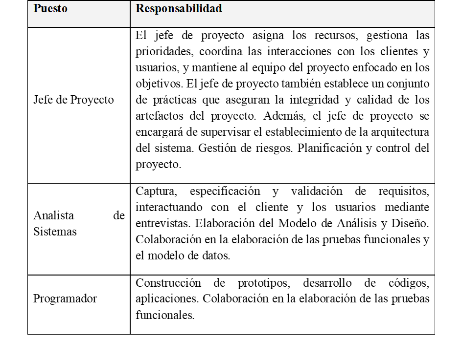

### 2.3	Esquema aplicativo del proyecto
El esquema aplicativo del proyecto se guiará por el estándar Cross Industry Standard Process for Data Mining (CRISP-DM),  en este caso se hará una aplicación parcial o adaptación debido a la naturaleza del proyecto.

## 3 Gestión del Proceso

### 3.1 Aplicación del modelo
El desarrollo se llevará a cabo en base a fases con una o más iteraciones en cada una de ellas. La siguiente tabla muestra la distribución de tiempo y el número de iteraciones de cada fase (para las fases de Construcción y Transición es sólo una aproximación muy preliminar).

Tabla 2. Fases del Proyecto

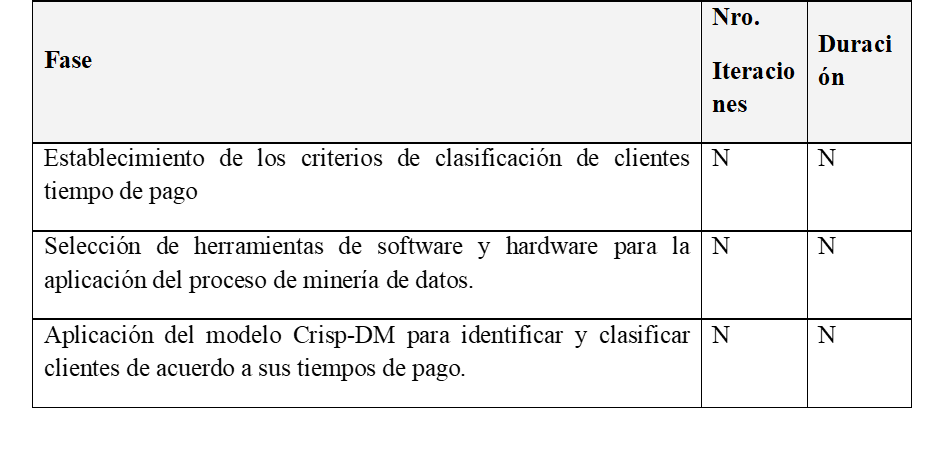

Los hitos que marcan el final de cada fase se describen en la siguiente tabla.

Tabla 3. Hitos del Proyecto

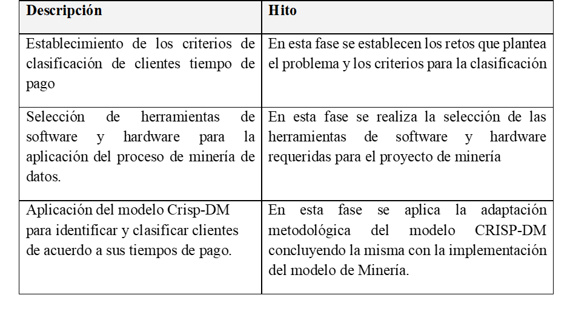

### 3.2 Calendario del Proyecto
Para este proyecto se ha establecido el siguiente calendario. La fecha de aprobación indica cuándo el artefacto en cuestión tiene un estado de completitud suficiente para someterse a revisión y aprobación, pero esto no quita la posibilidad de su posterior refinamiento y cambios. 
Tabla 4. Entregables Fase I

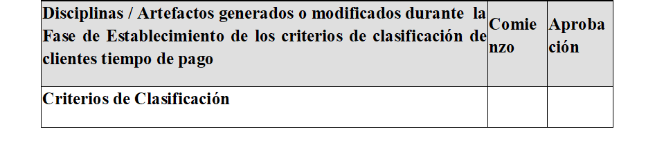

Tabla 5. Entregables Fase II

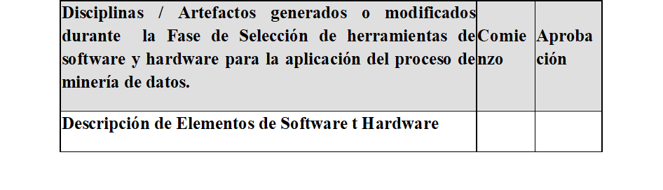

Tabla 6. Entregables Fase III

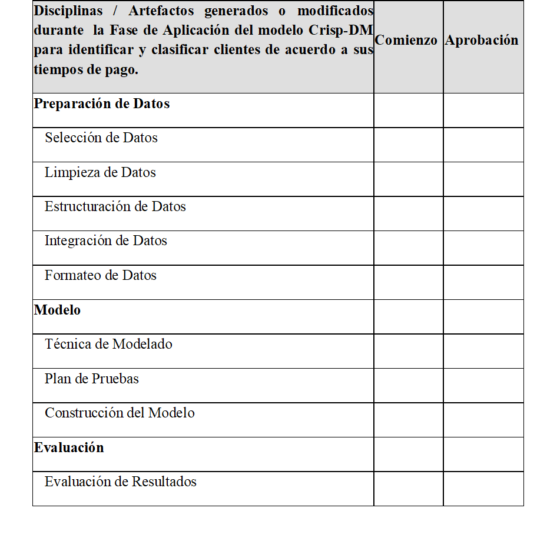

## 4 	Resultados del Proyecto

### 4.1	 Establecimiento de Criterios de Clasificación de Cliente por Tiempo de Pago
Como se mencionó en el planteamiento del problema, la clasificación de los clientes requiere de algún criterio para su aplicación, en este caso el tiempo de pago. La metodología utilizada para la clasificación consiste en la determinación del peso ponderado o frecuencia de los lapsos de tiempo en que los clientes realizan sus pagos, para este proyecto se consideraron las categorías generales de clasificación y unas subcategorías informativas para una mejor apreciación del comportamiento de los clientes. El tiempo de pago resulta de la diferencia entre la fecha en que se realiza la cancelación de un pago y la fecha de emisión de la factura que originó ese pago, esa diferencia puede contarse en días, y de acuerdo a ese criterio surge la siguiente clasificación para los clientes:

Tabla 7. Clasificación de Clientes

La razón por la cual se escoger por la cual se escoge usar el 95% de las observaciones y no el promedio es para aumentar el grado de certeza acerca del comportamiento de pago de los clientes, cosa que el tiempo promedio no puede reflejar, si bien la media nos proporciona un medida de tendencia central del comportamiento de la variable de tiempos de pago, es bien conocido que la misma no refleja las variaciones en función de las desviaciones estándar alrededor de ella, por este motivo, y aun tratándose de un problema de estadística descriptiva (donde contamos con todos los registros de pagos de los cliente, la población), se optó por hallar en qué lapso de tiempo se agrupan el 95% de los pagos de los clientes, el razonamiento anterior se puede dilucidar en el siguiente gráfico:

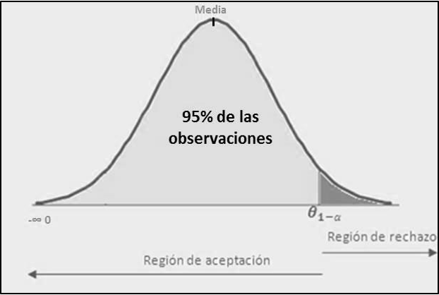

Figura 1. Pagos 95%

Como ya se mencionó, también se considera unas subcategorías de lapsos de tiempo a manera de visualizar mejor en comportamiento de pago, esta subclasificación agrupa los pagos de la siguiente manera:

Tabla 8. Clasificación de Pagos

### 4.2	 Elementos de Software y Hardware para la Implementación del Proyecto
- Para la ejecución del presente proyecto se hará uso  de los siguientes equipos de la empresa:

Tabla 9. Equipos de Hardware

El software requerido para la implementación del proyecto de minería fue el siguiente:
-	Para la preparación de los datos (selección, limpieza, estructuración, integración y formateo) se utilizó la herramienta Pentaho PDI 5.4.
-	Para la construcción del repositorio para los datos preparados se utilizó Microsoft SQL Server 2008
-	Para la implementación del modelo de Minería se utilizó RStudio 3.6

### 4.3 	Aplicación del modelo Crisp-DM para identificar y clasificar clientes de acuerdo a sus tiempos de pago. 
Por razones de tiempo y requerimientos del proyecto se realizó una adaptación del modelo Crisp-DM, y se precedió directamente a la preparación de datos, modelo de minería y evaluación.

#### 4.3.1	Preparación de Datos
#### 4.3.1.1	Selección de Datos
Los datos fueron obtenidos de la base de datos relacional que da soporte al sistema administrativo Mantis, en dicho sistema se realiza el registro de transacciones de la empresa como ventas y pagos, de allí que sea importante para la realización del proyecto, en concreto los Datos Objetivo o Data Target requeridos para la realización del proyecto son los siguientes:

Tabla 10. Datos Objetivo (Target)

##### 4.3.1.2	 Limpieza, estructuración, integración y formateo de los datos
Para poder utilizar los datos de formar eficiente para el proyecto de minería, fue necesario realizar procesos de Extracción Transformación y Carga de datos desde la base de datos relacional del sistema mantis hacia un repositorio de datos, estas actividades incluyen selección de los datos objetivo que estaban ubicados en diferentes tablas en la base de datos relacional, para simplificar y unir los datos en una única tabla fue necesario realizar uniones (join’s), renombrar datos, selección, eliminación de inconsistencias, formateo de los tipos de datos y cálculos, todo lo anterior previo a la inserción de los datos finales en el repositorio, los procesos ETL implementados para el proyecto de minería se pueden observar a continuación en la herramienta Pentaho PDI 5.4:

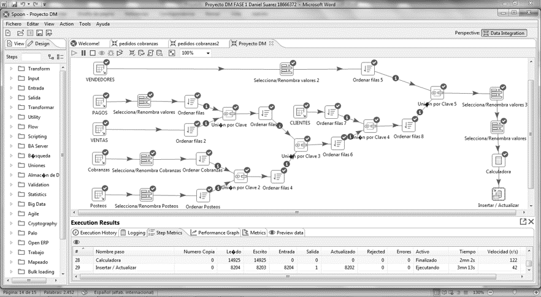

Figura 2. Preprocesamiento de Datos

#### 4.3.2	Modelo
El modelo diseñado para el trabajo de clasificación de datos comprende dos esquemas o etapas, el esquema de clasificación inicial de los datos, fundamentado en concepciones de estadística descriptiva descritos anteriormente, apoyado adicionalmente con un segundo modelo de árbol de decisión, específicamente árbol de clasificación,  ambos permiten clasificar a los clientes de la empresa y analizar su comportamiento de pago.

##### 4.3.2.1.1	Técnicas de Modelado 
-	Modelo de Clasificación Inicial

El modelo de clasificación, diseñado por el Autor, consiste básicamente en clasificar cada pago realizado por el cliente en grupos o rangos correspondientes a la cantidad de días que se tardó en cobrarle al cliente una deuda en relación a la fecha de emisión de la factura que origina esa deuda (tiempo que tardó el cliente en pagar), los días de cobro o días de pago (dependiendo de la perspectiva empresa/cliente) resultan de la diferencia entre la fecha en que un cobro se registra efectivamente y la fecha de la factura que originó la deuda. El modelo propuesto se puede apreciar gráficamente en la siguiente imagen:

Tabla 11. Modelo de Clasificación

En el ejemplo anterior  se muestra el caso hipotético del agrupamiento y clasificación de los pagos de un cliente, el modelo consiste en considerar y agrupar los clientes de acuerdo a la mayor presencia de pagos dentro de un grupo, específicamente el 95% de los pagos, un pago puede estar e diferentes grupos, por lo que se clasifica al cliente dentro del grupo con un rango menor que primero acumule el 95% de los pagos.

-	Modelo de Árbol de Decisión

El modelo utilizado para la construcción del árbol de decisión será tomado del algoritmo proporcionado por la librería del paquete rpart disponible para el lenguaje R:

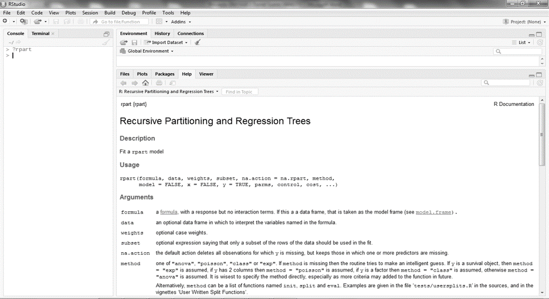

Figura 3. Paquete rpart

##### 4.3.2.1.2	Plan de Pruebas
-	Pruebas para Modelo de Clasificación Inicial

Para probar el modelo de clasificación se realizan 3 iteraciones de script y se documentaran los resultados para verificar que son consistentes, por cada iteración se toman 10 pagos de cada cliente de un total de 3 clientes para verificar que los pagos fueron clasificados y agrupados adecuadamente de acurdo al algoritmo, además, también se verifica que la clasificación general final de estos mismo clientes sea correcta.

-	Pruebas para del Modelo de Árbol de Clasificación

Para las pruebas del Modelo de Árbol de Decisión, al ser un problema de clasificación, se utiliza la razón del error como medida de calidad de los resultados del modelo, también se realizan pruebas de predicción y matriz de confusión, para ello se separan los datos analizados en dos conjuntos, un conjunto de entrenamiento y otro de prueba, luego se construye el modelo basado en el conjunto de entrenamiento y se compara la calidad del modelo generado con el conjunto de prueba.

##### 4.3.2.1.3	Construcción del Modelo

-	Modelo de Clasificación Inicial

o	Algoritmo del Modelo

El algoritmo a seguir para la aplicación del Modelo Clasificación se puede representar de la siguiente manera:

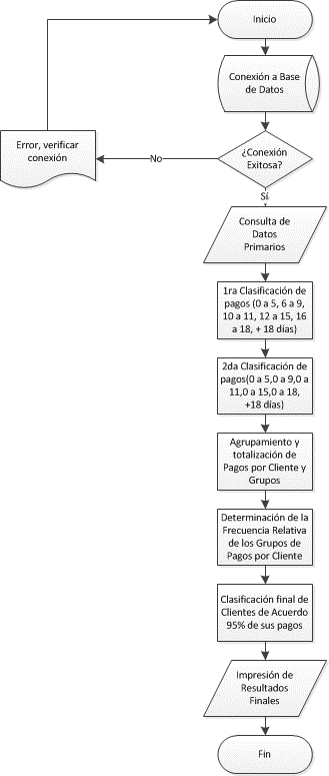

Figura 4. Algoritmo de Clasificación

-	Modelo de Árbol de Clasificación

o	Algoritmo para la aplicación del Modelo

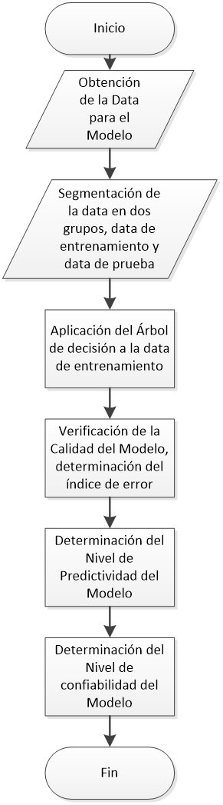

Figura 5. Algoritmo de Árbol de Decisión

#### 4.3.3	Evaluación 

##### 4.3.3.1	Evaluación de Resultados

-	Evaluación del Modelo de Clasificación, Iteraciones

Para las tres Iteraciones del Modelo de Clasificación se emplearán los clientes y pagos respectivos que se muestran a continuación, esta muestra fue tomada al azar:

Tabla 12. Iteraciones del Modelo de Clasificación

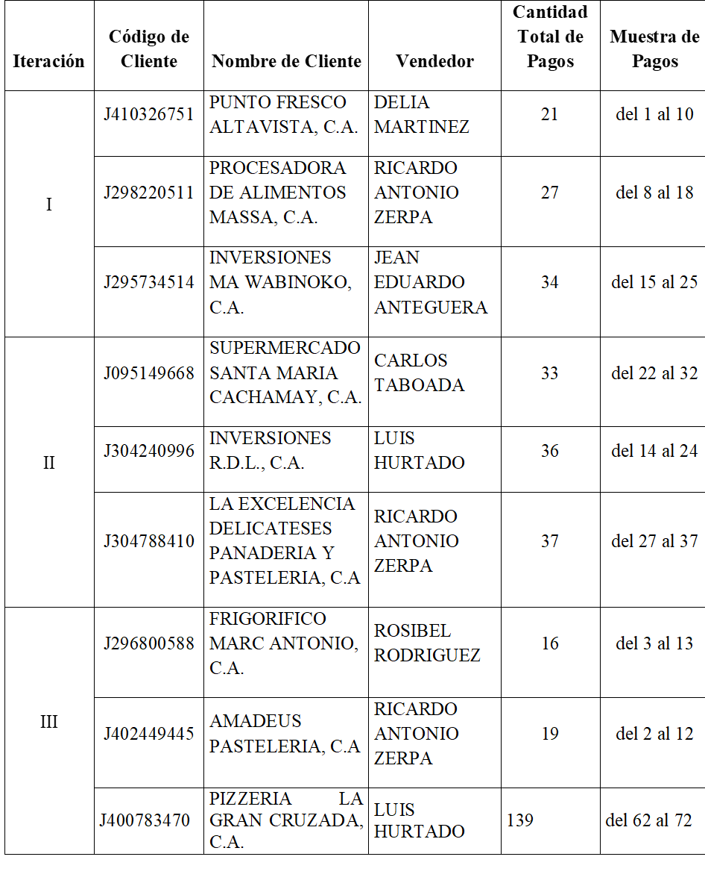

Resumen de Resultados del Modelo de Clasificación
Tabla 13. Resultados del Modelo de Clasificación

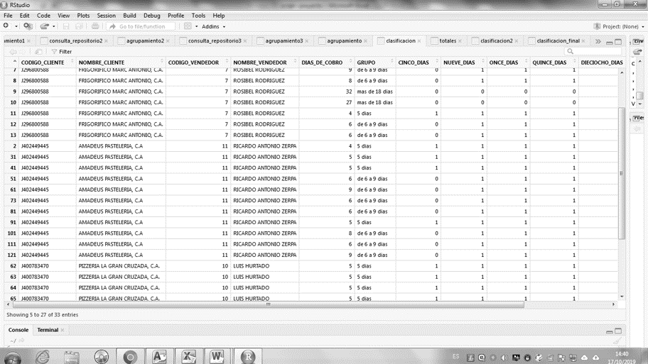

Figura 6. Dataframe clasificacion_final

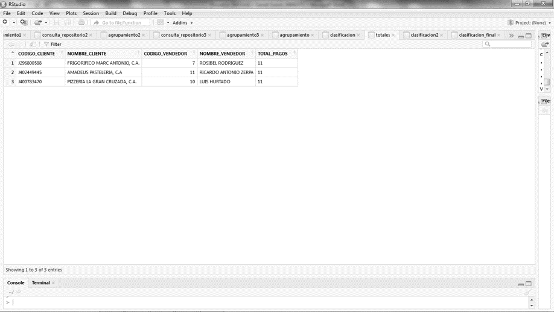

Figura 7. Dataframe totales

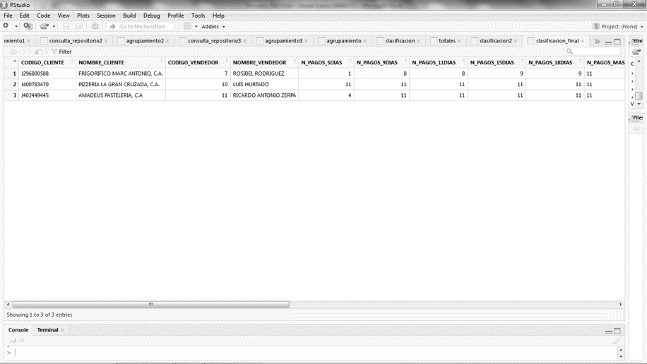

Figura 8. Dataframe clasificacion_final

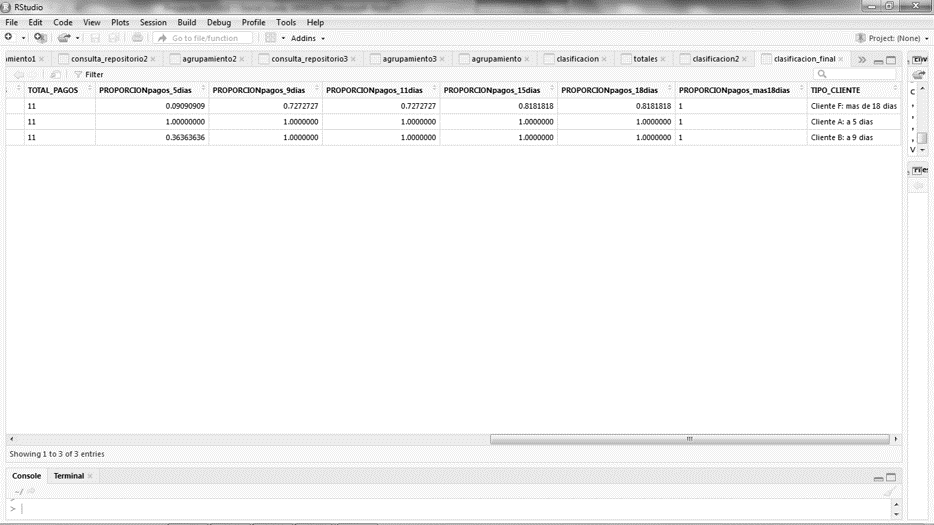

Figura 9. Dataframe clasificacion_final

-	Evaluación del Modelo de Árbol de Clasificación

Para la evaluación del modelo de Árbol se toma el total de los datos contenidos en la variable clasificacion_final y se aplica el algoritmo descrito inicialmente en la sección de construcción del modelo.

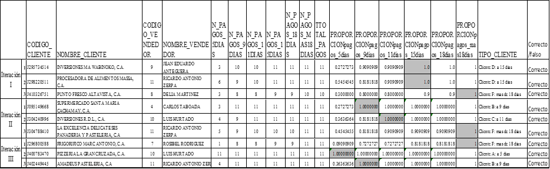

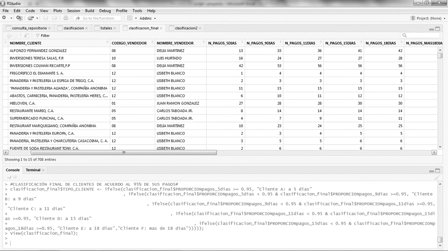

Figura 10. Dataframe clasificacion_final

Se extraen los datos requeridos partiendo de la variable clasificacion_final y se incluyen en la variable data_arbol,  luego estos datos se dividen en dos grupos, un grupo llamado data_entrenamiento  cuya variable cuenta con el 60% de las observaciones de la variable data_arbol, y data_prueba que contiene el 40%. Posteriormente se realiza una verificación de la calidad del modelo con la aplicación de matrices de confusión, se realiza un análisis de predictividad del modelo y las estadísticas de efectividad.

Se puede evidenciar que de una prueba de tres iteraciones, con una muestra total de 9 clientes escogidos al azar, 9 fueron clasificados correctamente, lo que se traduce en un 100% de efectividad del modelo de clasificación.

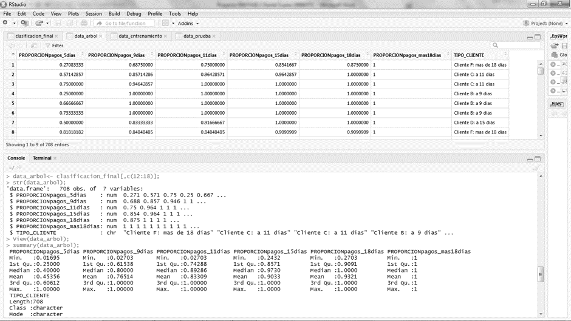

Figura 11. Str y summary, análisis de la variable clasificacion_final

Figura 12. Dataframe data_arbol

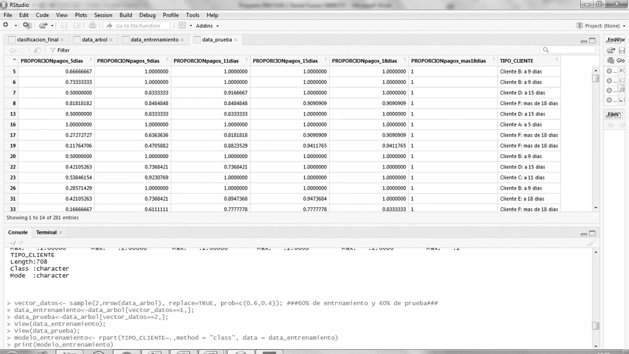

Figura 13. Análisis de data_arbol

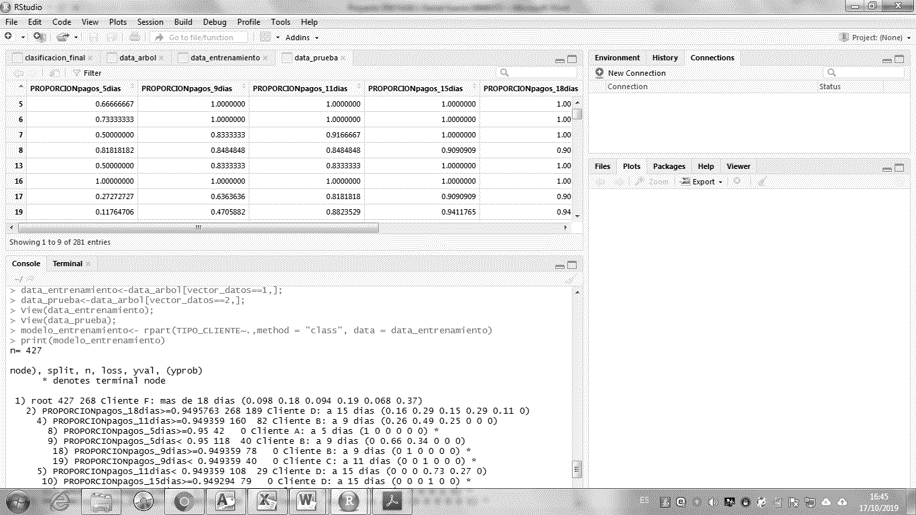

Figura 14. Árbol de Clasificación data_prueba

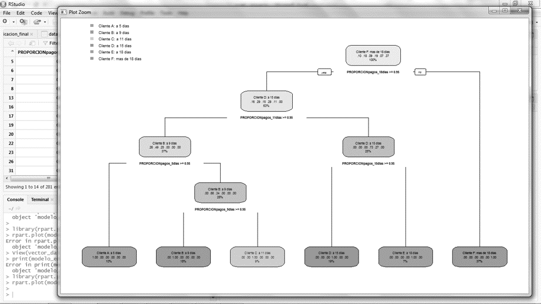

Figura 15. Gráfica Árbol de Clasificación data_prueba

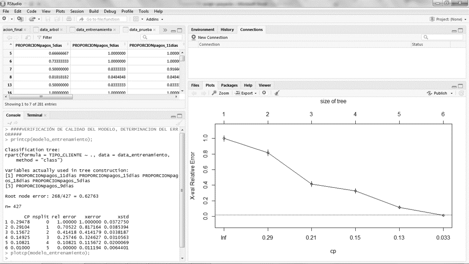

Figura 16. Nivel de Error Árbol de Clasificación data_prueba

Figura 17. Matriz de Confusión

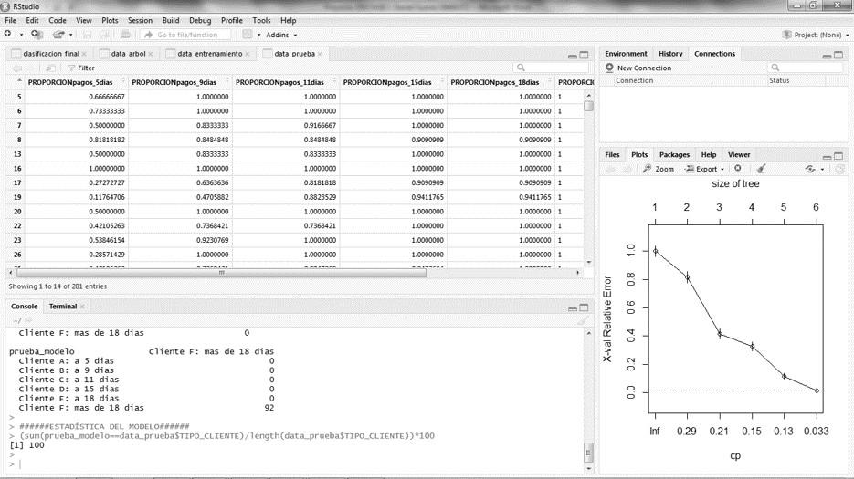

Figura 18.  Prueba de Efectividad

Las pruebas anteriores reflejan que el modelo aplicado tiene una validez y una efectividad del 100%
